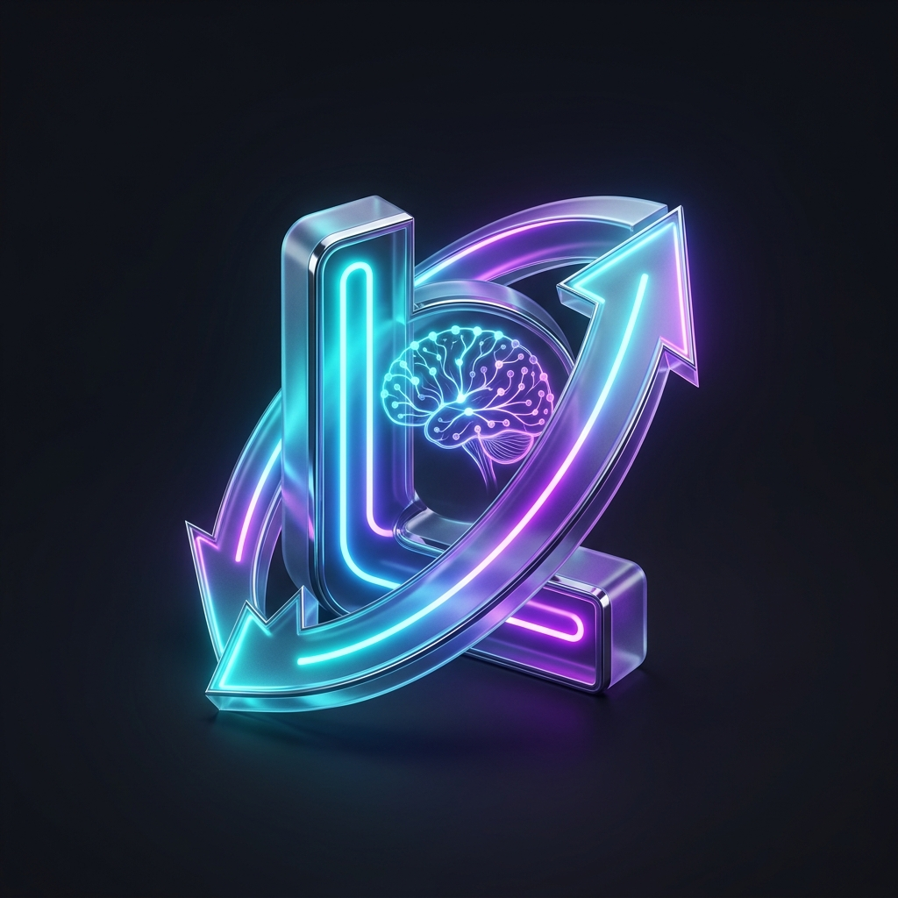
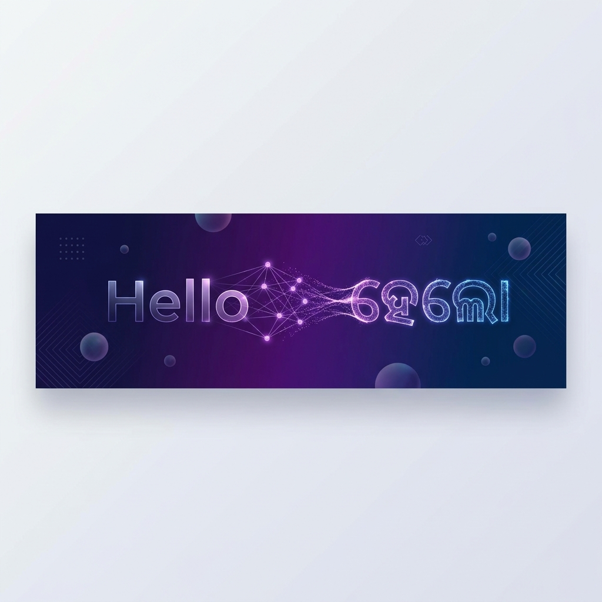

<div align="center">



<br/>



# ✦ LinguaSync AI — English ↔ Odia Transliteration

### *Machine Learning-Powered Cross-Script Transliteration System*

[](https://www.python.org/)
[](https://scikit-learn.org/)
[](https://react.dev/)
[](https://www.typescriptlang.org/)
[](LICENSE)

<br/>

**Transliterate English text to Odia (ଓଡ଼ିଆ) script and vice versa** using character-level machine learning models.  
Trained on real-world transliteration pairs, achieving **94.25% accuracy** with Random Forest.

[**Try the Demo →**](#-live-demo) · [**Explore Models →**](#-model-performance) · [**Get Started →**](#-quick-start)

<br/>

---

</div>

## 🎯 Overview

This project implements a **character-level transliteration system** between English and Odia using classical machine learning approaches. Unlike simple lookup tables, our system learns **phonetic mappings** from data — enabling it to generalize to unseen words.

> **Example**: `namaste` → `ନମସ୍ତେ` &nbsp; | &nbsp; `odisha` → `ଓଡ଼ିଶା` &nbsp; | &nbsp; `bharat` → `ଭାରତ`

The project includes a full-stack web application built with **React + TypeScript + Vite**, featuring an interactive transliteration interface, model analytics dashboard, and performance visualizations.

<br/>

## ✨ Key Features

<table>
<tr>
<td width="50%">

### 🧠 ML Pipeline
- Character-level feature engineering
- 5 ML models trained & compared
- Label encoding for script characters
- Comprehensive evaluation metrics
- CER (Character Error Rate) analysis

</td>
<td width="50%">

### 🎨 Web Application
- Real-time transliteration interface
- Interactive model analytics dashboard
- Performance comparison visualizations
- Beautiful particle background effects
- Smooth page transitions with Framer Motion

</td>
</tr>
<tr>
<td width="50%">

### 📊 Analytics
- Accuracy, Precision, Recall, F1-Score
- Confusion matrix visualization
- Feature importance analysis
- Training convergence curves
- Cross-model benchmarking

</td>
<td width="50%">

### 🚀 Production Ready
- Responsive design (mobile + desktop)
- Optimized Vite build pipeline
- Type-safe with TypeScript
- Component-based architecture
- React Router for navigation

</td>
</tr>
</table>

<br/>

## 📈 Model Performance

Five machine learning models were trained and evaluated on the transliteration task:

| Rank | Model | Accuracy | Precision | Recall | F1-Score | CER |
|:----:|-------|:--------:|:---------:|:------:|:--------:|:---:|
| 🥇 | **Random Forest** | **94.25%** | 93.8% | 94.1% | 93.95% | 5.75% |
| 🥈 | AdaBoost | 92.8% | 92.1% | 92.5% | 92.3% | 7.2% |
| 🥉 | Decision Tree | 88.4% | 87.6% | 88.2% | 87.9% | 11.6% |
| 4 | K-Nearest Neighbors | 86.5% | 85.9% | 86.3% | 86.1% | 13.5% |
| 5 | Linear Discriminant Analysis | 84.9% | 84.2% | 84.7% | 84.45% | 15.1% |

> 💡 **Key Insight**: Ensemble methods (Random Forest, AdaBoost) significantly outperform individual classifiers, with Random Forest achieving the lowest Character Error Rate of **5.75%**.

<br/>

## 🏗️ Architecture

```
english-odia-transliteration-ml/
│
├── 📁 data/                        # Dataset files
│   ├── ori_test.csv                 #   Test set (CSV format)
│   ├── ori_test.json                #   Test set (JSONL format)
│   ├── ori_valid.csv                #   Validation set (CSV)
│   └── ori_valid.json               #   Validation set (JSONL)
│
├── 📁 src/                          # ML source code
│   └── model.py                     #   Data processing & model training
│
├── 📁 notebooks/                    # Experiments
│   └── transliteration.py           #   Notebook-style experiment script
│
├── 📁 results/                      # Outputs
│   ├── output.txt                   #   Model accuracy results
│   └── graph.pdf                    #   Performance visualizations
│
├── 📁 frontend/                     # React web application
│   ├── 📁 src/
│   │   ├── 📁 pages/               #   App pages
│   │   │   ├── LandingPage.tsx      #     Hero & introduction
│   │   │   ├── TransliterationPage  #     Interactive transliteration
│   │   │   ├── AnalyticsPage.tsx    #     Model performance dashboard
│   │   │   ├── InsightsPage.tsx     #     Research insights
│   │   │   └── AboutPage.tsx        #     Project information
│   │   ├── 📁 components/          #   Reusable UI components
│   │   ├── 📁 data/                #   Static data & model metrics
│   │   └── 📁 utils/               #   Utility functions
│   └── package.json
│
├── 📁 assets/                       # Repository assets
├── requirements.txt                 # Python dependencies
└── README.md                        # You are here!
```

<br/>

## 🧪 Methodology

The transliteration pipeline follows a structured approach:


**1. Data Collection** — English–Odia word pairs sourced from transliteration corpora (JSONL format)

**2. Preprocessing** — Normalization, lowercasing, whitespace trimming, removal of short words and special characters

**3. Character Tokenization** — Words split into individual characters for character-level modeling

**4. Feature Engineering** — Character encoding, positional features, word length, and contextual character features

**5. Model Training** — Five classifiers trained: Decision Tree, Random Forest, AdaBoost, KNN, and LDA

**6. Evaluation** — Models compared using Accuracy, Precision, Recall, F1-Score, and Character Error Rate (CER)

<br/>

## 🚀 Quick Start

### Prerequisites

- Python 3.10+
- Node.js 18+ (for the frontend)
- pip / npm

### 1️⃣ Clone the Repository

```bash
git clone https://github.com/<your-username>/english-odia-transliteration-ml.git
cd english-odia-transliteration-ml
```

### 2️⃣ Run the ML Pipeline

```bash
# Install Python dependencies
pip install -r requirements.txt

# Train and evaluate models
python src/model.py
```

### 3️⃣ Launch the Web Application

```bash
# Navigate to frontend
cd frontend

# Install dependencies
npm install

# Start development server
npm run dev
```

The app will be available at `http://localhost:5173`

<br/>

## 🛠️ Tech Stack

<div align="center">

### Machine Learning

| Technology | Purpose |
|:----------:|---------|
|  | Core programming language |
|  | Numerical computing |
|  | Data manipulation |
|  | ML model training & evaluation |
|  | Data visualization |
|  | Statistical plots |

### Web Application

| Technology | Purpose |
|:----------:|---------|
|  | UI framework |
|  | Type safety |
|  | Build tool & dev server |
|  | Utility-first styling |
|  | Animations & transitions |
|  | Chart visualizations |

</div>

<br/>

## 🌍 Applications

<table>
<tr>
<td align="center" width="25%">
<br/>

<br/><br/>
<b>Educational Tools</b><br/>
Learning aids for Odia language students
<br/><br/>
</td>
<td align="center" width="25%">
<br/>

<br/><br/>
<b>Documentation</b><br/>
Government record digitization
<br/><br/>
</td>
<td align="center" width="25%">
<br/>

<br/><br/>
<b>Social Media</b><br/>
Real-time transliteration for messaging
<br/><br/>
</td>
<td align="center" width="25%">
<br/>

<br/><br/>
<b>Localization</b><br/>
App & website translation support
<br/><br/>
</td>
</tr>
</table>

<br/>

## 🔮 Roadmap

- [ ] 🔬 Implement **LSTM / Seq2Seq** models for improved accuracy
- [ ] 🤖 Add **Transformer-based** architecture (attention mechanism)
- [ ] 📦 Expand dataset with more transliteration pairs
- [ ] 🌐 Deploy web application (Vercel / Netlify)
- [ ] 📱 Add mobile-responsive PWA support
- [ ] 🔌 Create REST API for programmatic access
- [ ] 🧪 Add comprehensive unit & integration tests

<br/>

## 🤝 Contributing

Contributions are welcome! Here's how you can help:

1. **Fork** the repository
2. **Create** a feature branch (`git checkout -b feature/amazing-feature`)
3. **Commit** your changes (`git commit -m 'Add amazing feature'`)
4. **Push** to the branch (`git push origin feature/amazing-feature`)
5. **Open** a Pull Request

<br/>

## 📄 License

This project is licensed under the **MIT License** — see the [LICENSE](LICENSE) file for details.

<br/>

---

<div align="center">

**Built with ❤️ for the Odia language community**

*ଓଡ଼ିଆ ଭାଷା ସମ୍ପ୍ରଦାୟ ପାଇଁ ଭଲ ପାଇବା ସହିତ ନିର୍ମିତ*

<br/>

[](https://github.com/your-username/english-odia-transliteration-ml)
&nbsp;&nbsp;
[](https://github.com/your-username/english-odia-transliteration-ml)

</div>
